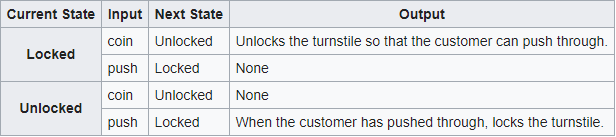

<h1 align="center">PHP State Machine</h1>

<p align="center">
	
</p>

<p align="center">
	<a href="https://scrutinizer-ci.com/g/jagarsoft/php-state-machine/?branch=master"></a>
	<a href="https://scrutinizer-ci.com/g/jagarsoft/php-state-machine/?branch=master"></a>
	<a href="https://scrutinizer-ci.com/g/jagarsoft/php-state-machine/build-status/master"></a>
	<a href="https://packagist.org/packages/jagarsoft/php-state-machine"></a>
	<a href="https://www.php.net/"></a>
    <a href="http://perso.crans.org/besson/LICENSE.html"></a>
    <a href="https://shields.io"></a>
</p>

# What is a State Machine?
It's a data structure made of two key items:
* States
* Transitions

Transitions go from an initial state to a destination state fired by events.

You can view a State Machine as a graph like this [^1]:


Also, you can think about it, as a double-entry array or _State Transition Table_ indexed by current state and current event. Content will be the next state [^1]:



Bound to the next state, you can set a action function that will be executed when event will be raised at the current state, after run, the new state will be set. In foremention example, output may be the action performed by bound function over some servomotor or something like that (save data, etc).

You can cancel the transition to the next state invoking _cancelTransition_ within action function. Current state will be remain.

Action functions are atomic. If you fire new events in an action function, they will be enqueued, and their action functions, if any, will be invoked consecutively, every time action function return.

If you cancel transition within a nested event, subsequent events may fail if no alternative event is defined for the current state.

Unexpected events for the current state will throw an exception.

You can fire common event from any state, by defining a _addCommonTransition_ with expected event and destination state only, but you must add all states yet.

[^1]: https://en.wikipedia.org/wiki/Finite-state_machine

# Installing

By _Composer_, just issue next command:

```bash
composer require jagarsoft/php-state-machine
```

# Getting started

```php
$state_1 = StateEnum::STATE_1;
$state_2 = StateEnum::STATE_2;
$state_3 = StateEnum::STATE_3;

$event_a = EventEnum::EVENT_A;
$event_b = EventEnum::EVENT_B;
$event_c = EventEnum::EVENT_C;

echo PHP_EOL;
$commonAction = function (StateMachine $sm){
    echo "My current state is {$sm->getCurrentState()}".
         " on {$sm->getCurrentEvent()}".
         " and {$sm->getNextState()} will be the next state".PHP_EOL;
};

(new StateMachine())
        ->addState($state_1)
        ->addState($state_2)
        ->addState($state_3)

        ->addTransition($state_1, $event_a, $state_2, $commonAction)
        ->addTransition($state_2, $event_b, $state_3, $commonAction)
        ->addTransition($state_3, $event_c, $state_1, $commonAction)

        ->fireEvent($event_a)
        ->fireEvent($event_b)
        ->fireEvent($event_c)

        ->fireEvent($event_a)
        ->fireEvent($event_b)
        ->fireEvent($event_c);
```

Output:

```bash
My current state is 1 on A and 2 will be the next state
My current state is 2 on B and 3 will be the next state
My current state is 3 on C and 1 will be the next state
My current state is 1 on A and 2 will be the next state
My current state is 2 on B and 3 will be the next state
My current state is 3 on C and 1 will be the next state
```

# Features

_StateMachine_ gives you the followings features:

1. You can prove a _event_ before it be fired
1. You can execute a _guard_ in order to cancel transition
1. You can execute a function _before_ and/or _after_ action
1. You can create _StateMachine_ from _Array_ or _Winzou_ config

Coming soon... you will be able to create _StateMachine_ from other sources, for instance, DOT definition.
_StateMachine_ so created is fully functional and will respond to their events.
Moveover, you will be able to save your current _StateMachine_ to that format too.


# Licence

GNU General Public License v2.0 only
